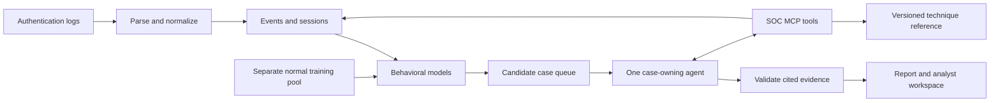

# Hestia architecture

Hestia is designed around one bounded investigation agent that owns a case. It
chooses which evidence to inspect through one read-only SOC MCP server, revises its
hypothesis, and returns a report whose claims refer to stored evidence.

The agent owns tool selection, investigative hypotheses, verdict and uncertainty.
Behavioral scores prioritize investigations; they do not assign threat verdicts.
Deterministic parsing, schemas, budgets and citation checks are infrastructure.
The final report must retain contradictory evidence and state when evidence is
insufficient. Hosted providers are configurable; no local GPU is required.

## Current foundation

- `ingestion/`: authentication parsing, source-qualified events, sessionization and structured-field tokenization.
- `datasets/`: dataset adapters, explicit subset import, integrity manifests and evaluation sidecars.
- `normality/`: feature contracts, circular hour counts, absolute deviation, two Half-Space Trees models, transition surprise, and drift primitives.
- `store/`: one embedded SQLite evidence store holding prepared evidence, case runs, traces, reports and analyst dispositions.
- `mcp/`: read-only catalog, evidence, history, normality-context and reference tools over stdio.
- `agent/`: one bounded case-owning agent with a provider redaction boundary, budgets and citation grounding.
- `runs/`: case identity, run lifecycle with one active run and restart recovery, server-side citation resolution, and the synthetic demo workspace.
- `api/`: health, catalogs, preparation and agent status, plus the case workspace API.
- `frontend/`: case queue, case detail, live investigation trace, report with openable citations, and review dispositions, with explicit loading, error, empty, not-ready and incomplete states.
- `evaluation/`: offline label joins and metrics; a separate HDFS v1 block-trace anomaly baseline reads a local public archive without putting its labels into the authentication evidence store.

Model training has not produced a ready artifact, so cases are unscored and the agent
has no anomaly score. Hosted-provider operation is implemented but not
acceptance-tested. Authentication report accuracy remains unmeasured. The separate
HDFS experiment measures only its event-transition baseline, not agent quality
or security-attack detection. Hestia does not perform
automatic triage, containment or remediation.

## Demonstration sequence

Today: start the container, seed the synthetic demo workspace, open a case, run the
labelled fixture investigation, watch its tool calls, open cited lines, and record a
review. See [the demo](DEMO.md).

After later milestones: replay a fixed public-data subset, open a candidate, show
agent tool requests and cited evidence, inspect its report, and compare against
held-out evaluation labels. Include a benign case and an insufficient-evidence case.
Report measured accuracy, false alerts, grounding, latency and cost separately.
A recorded replay must be identified as recorded; never present it as live inference.
